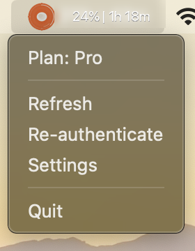
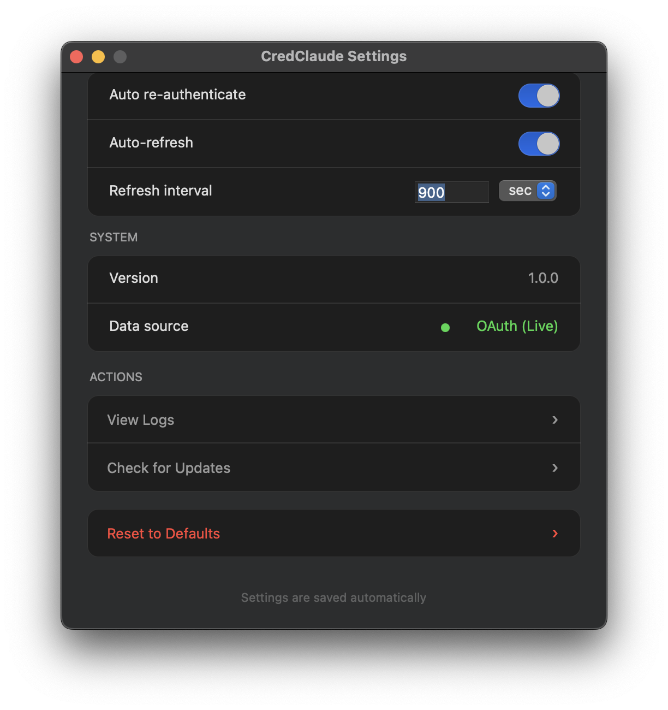

# CredClaude

<div align="center">
  
</div>

CredClaude is a macOS menu bar app that shows your current Claude usage and reset time at a glance.

## App Preview


*Menu bar view with quick access to refresh, re-authenticate, and settings.*


*Native settings for refresh behavior, re-authentication, logs, and app status.*

## User-Facing Features

- See your current usage percent and reset countdown directly in the menu bar.
- Open the dropdown for your detected plan, plus weekly usage details when Anthropic exposes them for your account.
- See extra usage status when it is enabled on your Claude account.
- Refresh immediately or reopen Claude login from the menu when you need to reconnect.
- Adjust auto-refresh and auto re-authentication in a lightweight native settings window.
- Install it once and let it start automatically every time you log in.

## Install / Getting Started

CredClaude currently installs from source on macOS. Before you install, make sure this Mac already has:

- macOS
- Python 3.11 or newer
- Claude Code installed and signed in

Then clone or download this repo and run:

```bash
bash install.sh
```

The installer will:

- create a local virtual environment
- install the app dependencies
- build `CredClaude.app`
- copy it to `~/Applications/CredClaude.app`
- register it to start automatically at login
- launch the app right away

After install:

- look for CredClaude in your menu bar
- if macOS blocks the first launch, open `~/Applications/CredClaude.app` from Finder with **Open**
- if needed, go to **System Settings > Privacy & Security** and choose **Open Anyway**

To remove the app:

```bash
bash uninstall.sh
```

CredClaude uses your existing Claude Code login to read live usage from Anthropic. Its own config, logs, and cached data live in `~/.credclaude/`.

## Developer Install / Local Setup

Clone the repository or download it locally:

```bash
git clone https://github.com/virajparmaj/claude-usage-monitor.git
cd claude-usage-monitor
```

Install dependencies for local development:

```bash
python3 -m venv venv
source venv/bin/activate
pip install -e .
pip install -r requirements-dev.txt
```

Run the app locally:

```bash
python -m credclaude
```

Build and install the app bundle locally:

```bash
bash install.sh
```

Run the test suite:

```bash
pytest -q
```

Local setup notes:

- CredClaude is macOS-only.
- Python 3.11+ is required.
- Full runtime behavior depends on macOS Keychain, Terminal automation, and `launchd`.
- `build_app.sh` expects macOS tools such as `sips`, `iconutil`, `cc`, and `plutil`.
- `install.sh` expects `launchctl`, `osascript`, `open`, `ditto`, and `xattr`.
- App data is stored in `~/.credclaude/`.
